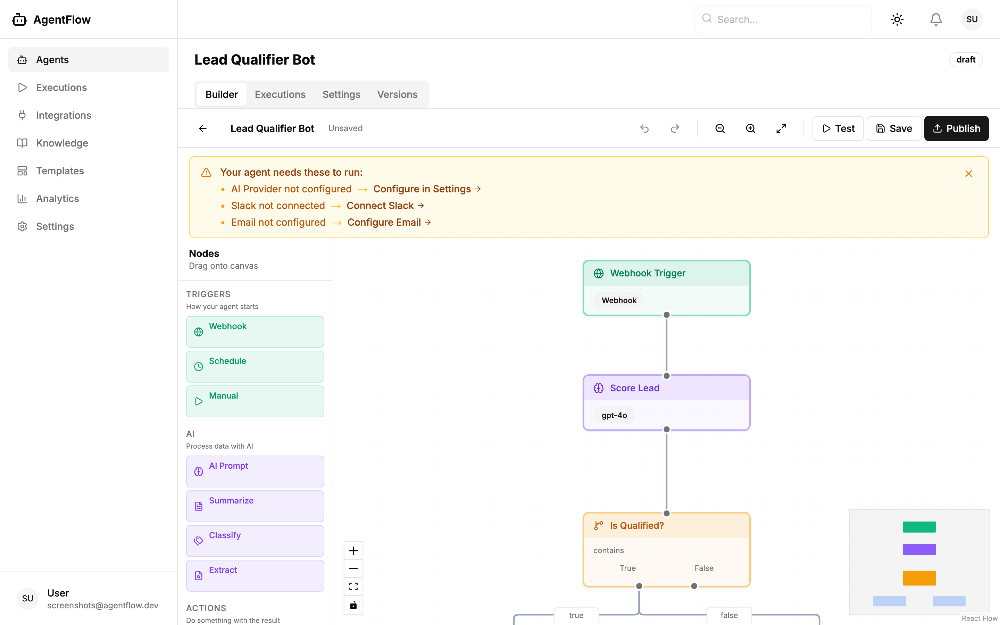
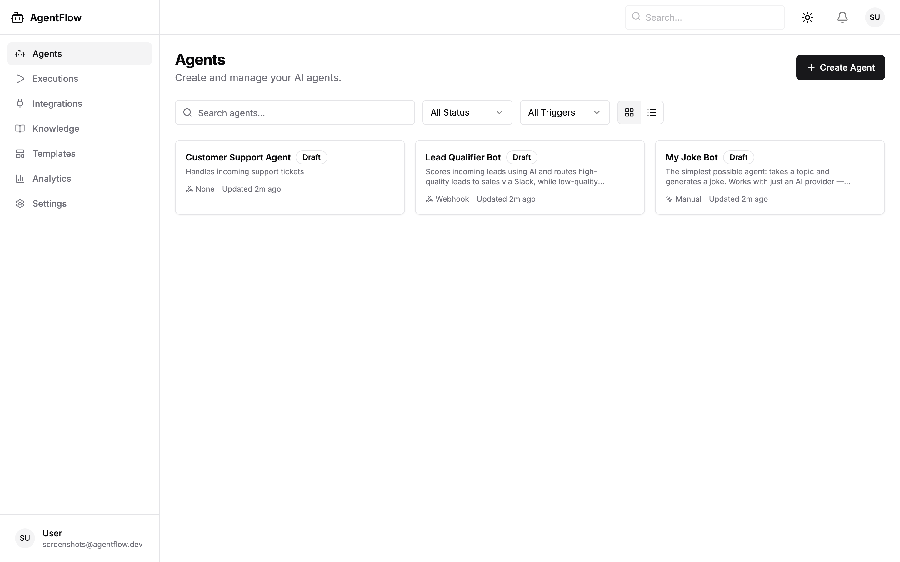
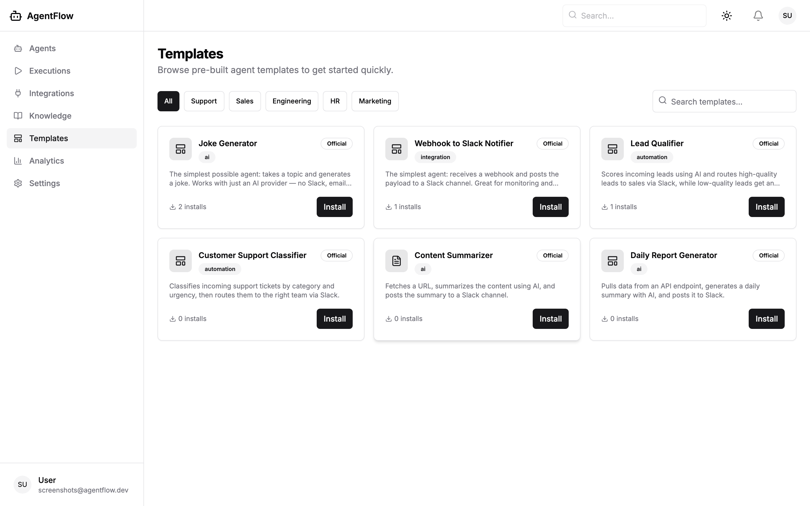
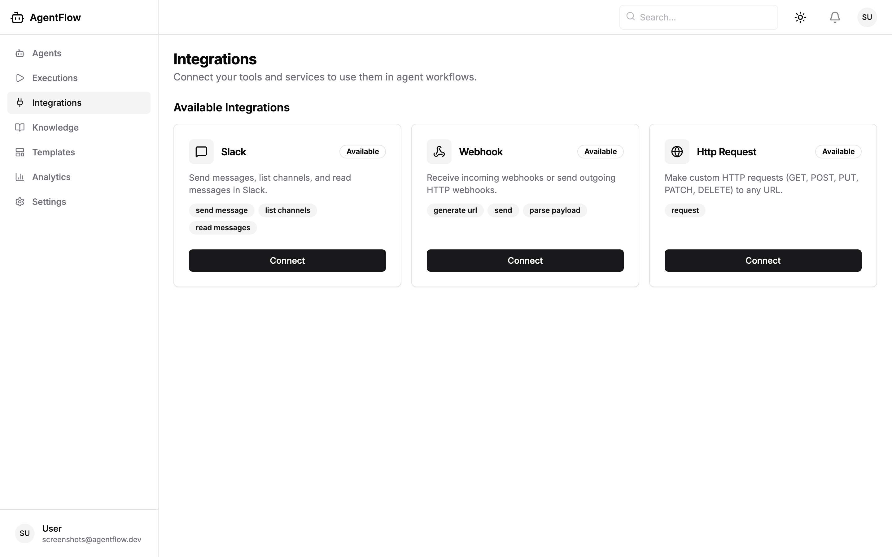
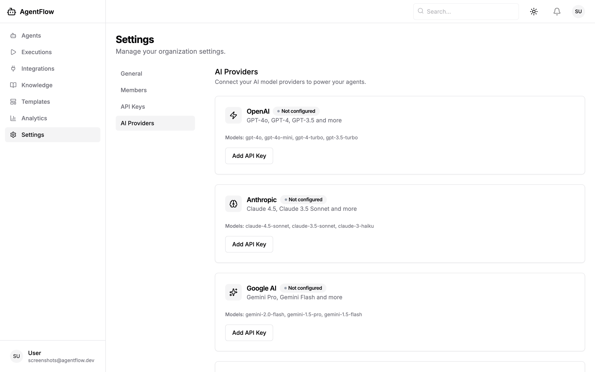
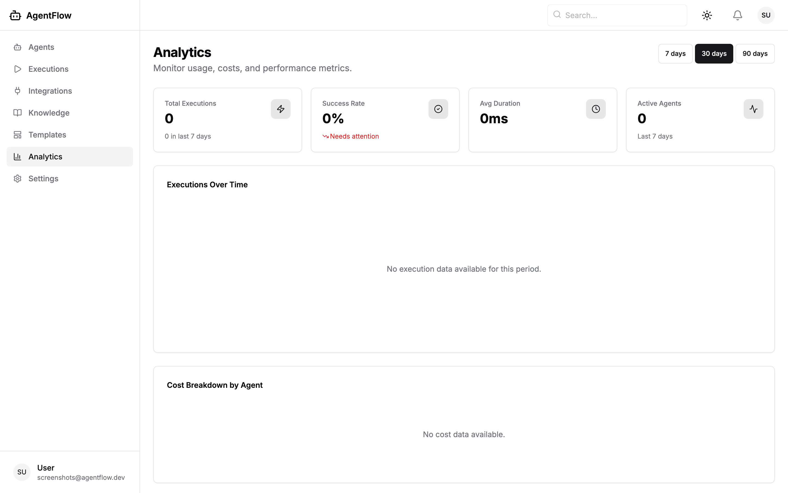
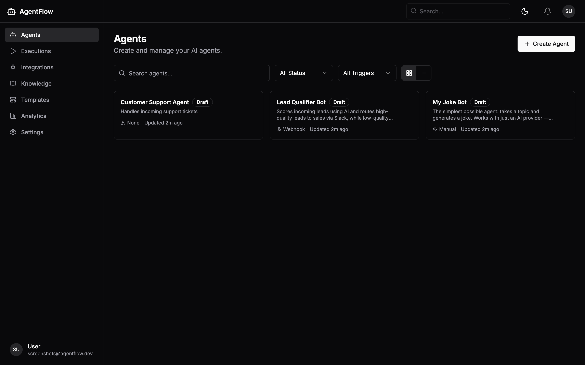

<p align="center">
  
</p>

<h1 align="center">AgentFlow</h1>

<p align="center">
  <strong>Open-source AI agent platform for building, deploying, and managing workflow automations.</strong>
</p>

<p align="center">
  <a href="#features">Features</a> &nbsp;&bull;&nbsp;
  <a href="#screenshots">Screenshots</a> &nbsp;&bull;&nbsp;
  <a href="#quick-start">Quick Start</a> &nbsp;&bull;&nbsp;
  <a href="#templates">Templates</a> &nbsp;&bull;&nbsp;
  <a href="#architecture">Architecture</a> &nbsp;&bull;&nbsp;
  <a href="#development">Development</a> &nbsp;&bull;&nbsp;
  <a href="#contributing">Contributing</a> &nbsp;&bull;&nbsp;
  <a href="#license">License</a>
</p>

<p align="center">
  
  
  
  
  
</p>

---

AgentFlow lets you build AI-powered workflow automations with a **visual drag-and-drop builder** — no code required. Connect your tools (Slack, email, webhooks), wire up AI nodes (OpenAI, Anthropic, Google, Ollama), add conditional logic, and deploy agents that run on triggers or schedules.

**Self-hostable.** Run it on your own infrastructure with Docker Compose. Your data stays with you.

---

## Features

**Visual Agent Builder** — Design workflows on a React Flow canvas. Drag trigger, AI, action, and logic nodes onto the canvas, connect them with edges, and configure each node in the sidebar.

**Multi-Provider AI** — Use OpenAI, Anthropic, Google, or Ollama. Configure API keys in settings. The engine routes to whichever provider you choose per-node, with automatic fallback support.

**Execution Engine** — Async execution with real-time step-by-step streaming via WebSocket. Branching logic (if/else) routes data down different paths. Full execution history with per-step timing, token usage, and cost tracking.

**Integrations** — Slack, email (SMTP), webhooks, and custom HTTP requests. OAuth flow for Slack. Plugin architecture for adding more.

**Pre-Built Templates** — 6 ready-to-use agent templates to get started in seconds. Install a template, customize it, and run.

**Preflight Checks** — Before you run a test, the builder warns you if required integrations (AI provider, Slack, email) aren't configured, with direct links to fix them.

**Knowledge Base (RAG)** — Upload documents, chunk them, generate embeddings with pgvector, and use semantic search in your agent workflows.

**Analytics** — Usage dashboard with execution counts, success rates, token usage, and cost breakdown per agent.

**Dark Mode** — Full dark mode support across the entire app.

**Auth & RBAC** — JWT authentication with role-based access control (Owner, Admin, Editor, Viewer).

**Self-Hostable** — Docker Compose setup. PostgreSQL, Redis, and the app — that's it.

---

## Screenshots

### Agent Builder
Build workflows visually with drag-and-drop nodes. The Lead Qualifier below scores leads with AI, then routes qualified leads to Slack and unqualified leads to an automated email.

<p align="center">
  
</p>

### Agents Dashboard
Manage all your agents in one place. See status, trigger type, and last updated at a glance.

<p align="center">
  
</p>

### Template Gallery
Get started fast with pre-built templates. Install one, customize it, and you're running.

<p align="center">
  
</p>

### Integrations
Connect your tools. OAuth for Slack, API keys for other services.

<p align="center">
  
</p>

### AI Provider Settings
Configure one or more AI providers. Bring your own API keys.

<p align="center">
  
</p>

### Analytics
Track usage, costs, and success rates across all your agents.

<p align="center">
  
</p>

### Dark Mode
Full dark mode support — builder, dashboard, and all pages.

<p align="center">
  
</p>

<p align="center">
  
</p>

---

## Quick Start

### Prerequisites

- [Docker](https://docs.docker.com/get-docker/) and Docker Compose
- [Node.js](https://nodejs.org/) 20+ and [pnpm](https://pnpm.io/) 9+
- [Python](https://python.org/) 3.12+

### 1. Clone and configure

```bash
git clone https://github.com/codersanket/agentflow.git
cd agentflow
cp .env.example .env
```

### 2. Start infrastructure

```bash
docker compose -f infra/docker/docker-compose.yml up -d
```

This starts **PostgreSQL 16** (with pgvector), **Redis 7**, and **Mailpit** (email testing).

### 3. Install dependencies

```bash
# Frontend
pnpm install

# Backend
cd apps/api && pip install -r requirements.txt
# Or with Poetry: cd apps/api && poetry install
```

### 4. Run database migrations

```bash
cd apps/api && alembic upgrade head
```

### 5. Start the app

```bash
# Terminal 1: Backend API
cd apps/api && uvicorn main:app --reload --host 0.0.0.0 --port 8000

# Terminal 2: Frontend
pnpm dev:web
```

Open [http://localhost:3000](http://localhost:3000) — sign up, and start building agents.

### 6. (Optional) Start Celery worker

For async execution (production-like behavior):

```bash
cd apps/api && celery -A workers.celery_app worker --loglevel=info
```

> **Note:** In development, the execution engine runs inline by default (no Celery needed). Set `CELERY_ENABLED=true` in `.env` to use the task queue.

---

## Templates

AgentFlow ships with **6 pre-built templates** that are automatically seeded when the server starts:

| Template | Category | Trigger | What It Does |
|----------|----------|---------|-------------|
| **Joke Generator** | AI | Manual | Takes a topic, generates a joke. Needs only an AI provider — perfect for testing. |
| **Customer Support Classifier** | Automation | Webhook | Classifies support tickets by category and urgency, routes to Slack. |
| **Content Summarizer** | AI | Manual | Fetches a URL, summarizes the content with AI. |
| **Lead Qualifier** | Automation | Webhook | Scores leads with AI, routes hot leads to sales (Slack) and cold leads to email. |
| **Daily Report Generator** | AI | Schedule | Pulls metrics from an API, generates a report with AI, posts to Slack. |
| **Webhook to Slack Notifier** | Integration | Webhook | Simplest possible agent: webhook in, Slack message out. |

Install any template from the **Templates** page, give it a name, and it creates a fully configured agent with nodes and edges ready to customize.

---

## Architecture

```
agentflow/
├── apps/
│   ├── web/          # Next.js 14 frontend (App Router, shadcn/ui, React Flow)
│   └── api/          # FastAPI backend (SQLAlchemy, Celery)
├── packages/         # Shared packages (future: SDK)
├── infra/            # Docker Compose
└── docs/             # PRD, Tech PRD, Plan
```

### How it works

```
                    ┌─────────────────┐
                    │   Next.js App   │
                    │  (React Flow)   │
                    └────────┬────────┘
                             │ REST + WebSocket
                    ┌────────▼────────┐
                    │   FastAPI API   │
                    └────────┬────────┘
                             │
              ┌──────────────┼──────────────┐
              │              │              │
     ┌────────▼──┐  ┌───────▼───┐  ┌───────▼───────┐
     │ PostgreSQL │  │   Redis   │  │ Celery Worker │
     │ + pgvector │  │  (cache/  │  │  (optional)   │
     │            │  │   queue)  │  │               │
     └────────────┘  └───────────┘  └───────┬───────┘
                                            │
                                   ┌────────▼────────┐
                                   │ Execution Engine │
                                   │  Orchestrator    │
                                   └────────┬────────┘
                                            │
                          ┌─────────────────┼─────────────────┐
                          │                 │                 │
                   ┌──────▼──────┐  ┌───────▼──────┐  ┌──────▼──────┐
                   │ AI Providers │  │ Integrations │  │    Tools    │
                   │ OpenAI      │  │ Slack        │  │ HTTP Req    │
                   │ Anthropic   │  │ Email        │  │ Webhook     │
                   │ Google      │  │ ...          │  │ ...         │
                   │ Ollama      │  │              │  │             │
                   └─────────────┘  └──────────────┘  └─────────────┘
```

### Execution Pipeline

1. **Trigger** — Webhook, manual, or schedule starts the execution
2. **Topological Sort** — Engine determines node execution order from the graph
3. **Step Execution** — Each node runs in order, with variable resolution (`{{Node Label.output.field}}`)
4. **Branching** — Logic nodes evaluate conditions and route to `true`/`false` branches; inactive branches are skipped
5. **Integration Loading** — Org's connected integration credentials are loaded into the execution context
6. **Streaming** — Each step emits events via WebSocket for real-time UI updates
7. **Completion** — Execution marked as completed/failed with total tokens and cost

### Tech Stack

| Layer | Technology |
|-------|-----------|
| **Frontend** | Next.js 14, TypeScript (strict), Tailwind CSS, shadcn/ui, React Flow, Zustand |
| **Backend** | FastAPI, SQLAlchemy 2.0 (async), Pydantic v2, Alembic |
| **Engine** | Topological graph executor, branching, variable resolution |
| **AI** | OpenAI, Anthropic, Google Gemini, Ollama (via httpx) |
| **Database** | PostgreSQL 16 + pgvector |
| **Cache/Queue** | Redis 7, Celery (optional) |
| **Auth** | JWT (access + refresh tokens), API keys (SHA-256 hashed) |

---

## Development

### Project Scripts

```bash
pnpm dev:web          # Start frontend dev server (Next.js)
pnpm docker:up        # Start Postgres + Redis via Docker
pnpm docker:down      # Stop infrastructure
```

### Backend

```bash
cd apps/api
uvicorn main:app --reload          # Dev server with hot-reload
alembic upgrade head               # Run migrations
alembic revision --autogenerate -m "description"  # Create migration
python -m scripts.seed_templates   # Re-seed templates
```

### Frontend

```bash
cd apps/web
pnpm dev              # Dev server
pnpm build            # Production build
pnpm lint             # ESLint
```

### Environment Variables

Copy `.env.example` to `.env` and configure:

| Variable | Description | Default |
|----------|-------------|---------|
| `DATABASE_URL` | PostgreSQL connection string | `postgresql+asyncpg://...` |
| `REDIS_URL` | Redis connection string | `redis://localhost:6379/0` |
| `JWT_SECRET_KEY` | Secret for signing JWTs | (required) |
| `CELERY_ENABLED` | Enable Celery task queue | `false` |
| `API_CORS_ORIGINS` | Allowed CORS origins | `http://localhost:3000` |

---

## Project Structure

```
apps/api/
├── main.py                 # FastAPI entry point + template seeding
├── core/                   # Config, database, security, Redis
├── models/                 # SQLAlchemy models (User, Agent, Execution, ...)
├── schemas/                # Pydantic request/response schemas
├── routers/                # API route handlers
├── services/               # Business logic layer
├── engine/
│   ├── orchestrator.py     # Graph executor with branching
│   ├── executor.py         # Step executor with retry
│   ├── variable_resolver.py # Template variable resolution
│   ├── handlers/           # Node type handlers (trigger, ai, action, logic, human)
│   ├── providers/          # LLM provider abstraction (OpenAI, Anthropic, Google, Ollama)
│   ├── tools/              # Integration tools (Slack, webhook, HTTP)
│   └── rag/                # RAG pipeline (chunking, embeddings, retrieval)
├── workers/                # Celery tasks
├── migrations/             # Alembic migrations
└── scripts/                # Seed scripts

apps/web/
├── app/
│   ├── (auth)/             # Login, signup pages
│   └── (dashboard)/        # Authenticated app (agents, builder, executions, ...)
├── components/
│   ├── ui/                 # shadcn/ui components
│   ├── builder/            # React Flow canvas, nodes, edges, config panels
│   ├── onboarding/         # Onboarding wizard
│   └── shared/             # Sidebar, topbar, theme toggle
├── stores/                 # Zustand state management
├── lib/                    # API client, WebSocket client, utilities
└── types/                  # TypeScript type definitions
```

---

## API

The backend exposes a RESTful API at `/api/v1/`. Key endpoints:

| Method | Endpoint | Description |
|--------|----------|-------------|
| `POST` | `/auth/signup` | Create account |
| `POST` | `/auth/login` | Get JWT tokens |
| `GET` | `/agents` | List agents |
| `POST` | `/agents` | Create agent |
| `GET` | `/agents/:id` | Get agent with latest version |
| `POST` | `/agents/:id/execute` | Run an agent |
| `POST` | `/agents/:id/test` | Test run with data |
| `GET` | `/executions/:id/steps` | Get execution steps |
| `GET` | `/templates` | List templates |
| `POST` | `/templates/:id/install` | Install a template |
| `GET` | `/integrations` | List integrations |
| `GET` | `/org/ai-providers` | List AI providers |
| `PUT` | `/org/ai-providers/:provider` | Configure AI provider |

Full API docs available at `http://localhost:8000/docs` (Swagger UI) when the backend is running.

---

## Contributing

We welcome contributions! Here's how to get started:

1. Fork the repository
2. Create a feature branch (`git checkout -b feature/my-feature`)
3. Make your changes
4. Run the linters and tests
5. Submit a pull request

### Guidelines

- Follow existing code patterns and conventions
- Write TypeScript with strict mode for frontend changes
- Use async/await for all backend I/O operations
- Scope all database queries by `org_id` (multi-tenant)
- Add Alembic migrations for schema changes

---

## Roadmap

- [ ] **Python SDK** — Build agents programmatically
- [ ] **TypeScript SDK** — npm package for agent management
- [ ] **More Integrations** — Jira, GitHub, Salesforce, Google Sheets
- [ ] **Scheduled Triggers** — Cron-based agent execution
- [ ] **Agent Marketplace** — Share and discover community templates
- [ ] **Cloud Hosting** — Managed cloud tier with Stripe billing
- [ ] **SSO/SAML** — Enterprise authentication
- [ ] **Audit Logs** — Full activity tracking

---

## License

AgentFlow is licensed under the [GNU Affero General Public License v3.0](LICENSE).

You can freely use, modify, and distribute AgentFlow. If you run a modified version as a network service, you must make the source code available to users of that service.

---

## Links

- [Technical PRD](docs/TECH_PRD.md)
- [Product Requirements](docs/PRD.md)
- [Implementation Plan](docs/PLAN.md)
- [Self-Hosting Guide](docs/SELF_HOSTING.md)

---

<p align="center">
  Built with FastAPI, Next.js, React Flow, and a lot of coffee.
</p>
